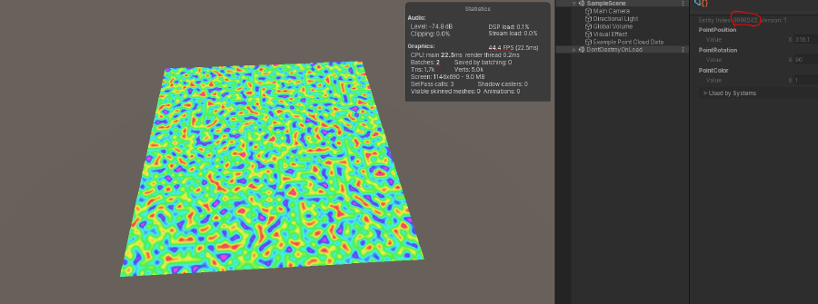

# DOTS Point Clouds



Supports Unity 2020.1 and higher. The image above shows a grid of 10 million quads rendered on a mid range laptop at 45 fps. Since the input data is in `Entity` `ComponentData`, detailed simulations can be done with the full power of the CPU and rendered with the full power of the GPU.

Updates to the point cloud are handled by a `ComponentSystem` per `ComponentData` type. Each `ComponentSystem` is triggered via an event `Entity`.

The component types are all available under the `Unity.PointClouds` namespace.

## How To Install

In order to install this as a package in your project, add the following to the top of your manifest.json file right before the dependencies object. Next, save the file and restart the editor. You should then find the package in the package manager UI which can be installed like any other Unity package. You can even view a list of all previous versions of the package that are available in my registry.

``` js
"scopedRegistries": [
    {
        "name": "Scriptable Framework Packages",
        "url": "http://35.227.114.200:8080",
        "scopes": [
            "com.open"
        ]
    }
],
```

The manifest.json file can be found under:

"YOUR-PROJECT-FOLDER" > Packages > manifest.json

This needs to be done once for each Unity project you intend to use the package with because new Unity projects are always created with the default manifest.json file for that editor version.

If you can't see the latest version of DOTS Points Clouds in the package manager UI, it's likely because it supports only a later version of Unity than you are currently using.
